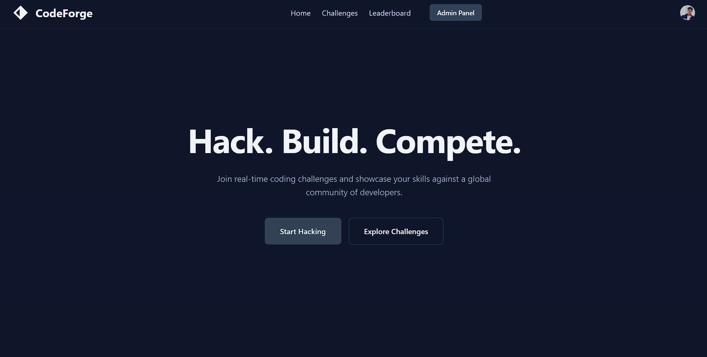
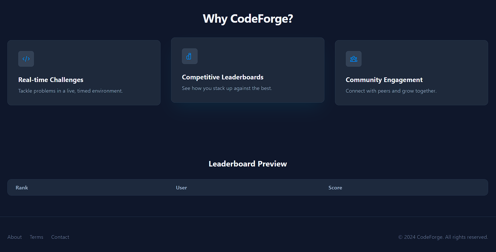

# CodeForge

CodeForge is a full-stack platform for coding, hackathons, and problem-solving. It features user authentication (including Google login), problem management, code judging, and hackathon organization.

## Features

- **User Authentication:** Register, login, and Google OAuth support
- **Problem Management:** Create, update, and solve coding problems
- **Hackathons:** Organize and participate in hackathons
- **Code Judging:** Judge code submissions using Judge0 API
- **Modern Frontend:** Built with React and Vite
- **RESTful Backend:** Node.js, Express, MongoDB

## Tech Stack

- **Frontend:** React, Vite, Tailwind CSS
- **Backend:** Node.js, Express, MongoDB
- **Authentication:** JWT, Google OAuth
- **Code Judging:** Judge0 API

## Getting Started

### Prerequisites
- Node.js & npm
- MongoDB

### Screenshots




### Installation

1. Clone the repository:
   ```sh
   git clone https://github.com/theshankarshandwivedi/CodeForge.git
   cd CodeForge
   ```
2. Install dependencies for both frontend and backend:
   ```sh
   cd back
   npm install
   cd ../front
   npm install
   ```
3. Set up environment variables:
   - Create `.env` files in `back/` and add:
     ```env
     MONGO_URI=your_mongodb_uri
     JWT_SECRET_KEY=your_jwt_secret
     GOOGLE_CLIENT_ID=your_google_client_id
     RAPIDAPI_KEY=your_judge0_api_key
     ```

### Running the App

- **Backend:**
  ```sh
  cd back
  npm start
  ```
- **Frontend:**
  ```sh
  cd front
  npm run dev
  ```

## Folder Structure

```
CodeForge/
├── back/        # Backend (Node.js, Express)
├── front/       # Frontend (React, Vite)
```

## Contributing

Pull requests are welcome! For major changes, please open an issue first to discuss what you would like to change.


**Made with ❤️ by theshankarshandwivedi**
